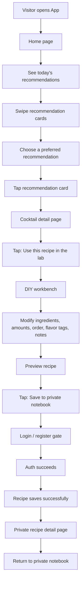

# WishToday Core Flow Page Design

Date: 2026-07-08
Status: Approved draft

## Scope

This document defines the first MVP core flow for WishToday. The first version validates one product promise:

```text
A visitor can discover a recommended cocktail, adapt it in the lab, save it after login, and see it preserved as a private recipe.
```

The first version does not attempt to build a complete community, profile system, settings system, or general-purpose recipe editor.

## Core Flow



## Page Groups

Discovery:
- HomePage

Decision:
- CocktailDetailPage

Adaptation:
- DiyWorkbenchPage
- AddIngredientSheet

Confirmation:
- PreviewRecipePage

Save and archive:
- AuthPages
- RecipeDetailPage
- NotebookPage

## 1. HomePage

Goal: Let a visitor immediately understand "what should I drink today" and choose one recommendation to inspect.

Entry points:
- First app open
- Bottom tab Home
- Return from other pages

First version content:
- WishToday brand title
- One short daily greeting or inspiration line
- Today's recommendations title
- Horizontal recommendation card carousel
- Card position indicator

Recommendation card fields:
- Cocktail image
- Chinese name
- English name
- Flavor tags
- Base spirit
- Alcohol level
- One recommendation sentence

Primary actions:
- Swipe recommendation cards left and right
- Tap the current recommendation card

Navigation:
- Tapping a recommendation opens CocktailDetailPage with `cocktailId`

States:
- Recommendations loading
- Recommendations failed
- Recommendations empty
- Image failed
- Visitor state

Out of scope:
- Shake recommendation
- Strong login prompt
- Complex personalization
- Weather, city, or mood recommendation
- Favorite button
- Community feed entry

Decision: The first core flow uses daily recommendation cards only. Shake recommendation is excluded from this flow.

## 2. CocktailDetailPage

Goal: Convince the user that the recommended cocktail is worth adapting and provide one clear path into the lab.

Entry point:
- HomePage recommendation card

Content:
- Cocktail hero image
- Chinese name
- English name
- One flavor description or recommendation sentence
- Base spirit
- Glass type
- Alcohol level
- Difficulty
- Flavor tags
- Flavor radar chart
- Ingredient list
- Mixing steps
- Bartender notes
- Primary bottom action: Use this recipe in the lab

Recommended content order:
1. Hero image, name, recommendation sentence
2. Base information: base spirit, glass type, alcohol level, difficulty
3. Flavor tags
4. Flavor radar chart
5. Ingredient list
6. Mixing steps
7. Bartender notes
8. Use this recipe in the lab

Primary actions:
- Scroll and inspect details
- Tap "Use this recipe in the lab"

Navigation:
- Opens DiyWorkbenchPage with `cocktailId`
- Imports the current cocktail as the initial DIY draft

Data imported into the lab:
- Recipe name
- English name
- Base spirit
- Ingredient list
- Ingredient amounts
- Ingredient units
- Default step order
- Flavor tags
- Source cocktail id

States:
- Detail loading
- Detail failed
- Detail not found
- Image failed
- Import to lab failed
- Visitor state

Out of scope:
- Favorite cocktail
- Comments
- Share
- Related cocktails
- Similar cocktails
- Long-form story content
- Ingredient substitution suggestions
- Ingredient purchase entry

Decision: The detail page has only one primary action in version one: "Use this recipe in the lab."

## 3. DiyWorkbenchPage

Goal: Let the user adapt an imported classic cocktail without losing the draft or facing a blank recipe editor.

Entry point:
- CocktailDetailPage primary action

On entry:
- Read the source recipe for `cocktailId`
- Create an unsaved DIY draft
- Import source ingredients, amounts, units, and step order
- Display the page as "Adapted from [cocktail name]"

Content:
- Page title: Lab
- Source hint: Adapted from [cocktail name]
- Recipe name input
- Optional English name input
- Selected ingredient list
- Add ingredient button
- Flavor tag selector
- Notes input
- Primary bottom action: Preview recipe

Selected ingredient row fields:
- Ingredient name
- Ingredient category
- Amount
- Unit
- Step number
- Drag handle
- Delete action

Supported ingredient row operations:
- Edit amount
- Edit unit
- Drag to reorder
- Delete ingredient

Primary actions:
- Edit recipe name
- Edit ingredient amount
- Edit ingredient unit
- Reorder ingredients
- Delete ingredient
- Add ingredient
- Select flavor tags
- Fill notes
- Tap Preview recipe

Add ingredient behavior:
- Opens AddIngredientSheet
- New ingredients append to the current draft
- Existing draft content must not be lost

Preview behavior:
- Opens PreviewRecipePage with the current DIY draft

Validation:
- Recipe name is required
- At least one ingredient is required
- Every ingredient amount is required
- Every ingredient unit is required

States:
- Draft initializing
- Draft initialization failed
- Normal editing
- Ingredient added
- Ingredient deleted
- Reordered
- Unsaved draft
- Validation failed

Out of scope:
- Create recipe from scratch
- Edit saved recipe
- Automatic alcohol calculation
- Automatic flavor radar generation
- Ingredient substitution suggestions
- Complex step editor
- Image upload
- Draft box

Decision: Version one only supports adapting from a classic cocktail. It does not support creating a recipe from scratch.

## 4. AddIngredientSheet

Goal: Let the user quickly append one material to the current DIY draft.

Entry point:
- DiyWorkbenchPage Add ingredient button

Recommended form:
- Bottom sheet or half-screen selector
- Not a full material encyclopedia

Content:
- Title: Add ingredient
- Search input
- Horizontal category filter
- Ingredient list
- Done or close action

Categories:
- Base spirit
- Liqueur
- Syrup
- Carbonated drink
- Juice
- Dairy
- Seasoning
- Fresh fruit
- Herb
- Garnish

Ingredient list item fields:
- Ingredient name
- Ingredient category
- Short description, optional
- Alcohol level, optional
- Add button

Primary actions:
- Search ingredient
- Switch category
- Add ingredient
- Close and return to workbench

Add rules:
- Added ingredient joins the current DIY draft
- New ingredient amount starts empty or zero
- New ingredient unit defaults to ml
- New ingredient step number appends to the end
- Added button changes to Added

Duplicate rule:
- Version one does not allow duplicate ingredients
- If the ingredient already exists, show "This ingredient is already in the recipe"

Return behavior:
- Existing draft remains
- Added ingredients remain
- New ingredients appear at the end of the selected ingredient list

States:
- Ingredient list loading
- Ingredient list failed
- Searching
- No search results
- Category empty
- Add success
- Duplicate ingredient
- Network error

Out of scope:
- Ingredient detail page
- Ingredient image upload
- Custom new ingredient
- Batch add
- Substitution suggestions
- Ingredient favorites
- Ingredient encyclopedia

Decision: Version one uses a bottom sheet or half-screen selector instead of a standalone full material library page.

## 5. PreviewRecipePage

Goal: Let the user confirm the adapted recipe before saving and make the recipe feel like their own creation.

Entry point:
- DiyWorkbenchPage Preview recipe action

Content:
- Page title: Preview recipe
- Recipe name
- Optional English name
- Source hint: Adapted from [classic cocktail name]
- Base spirit
- Flavor tags
- Ingredient summary
- Mixing order
- User notes
- Secondary action: Return to edit
- Primary action: Save to private notebook

Ingredient summary:
- Ingredient name
- Amount
- Unit

Mixing order:
- Step number
- Ingredient name
- Amount
- Unit

Primary actions:
- Inspect preview
- Return to edit
- Save to private notebook

Return behavior:
- Goes back to DiyWorkbenchPage
- Keeps all draft content

Save behavior:
- If unauthenticated, opens Auth Flow
- If authenticated, saves directly

After successful save:
- Open RecipeDetailPage for the newly saved recipe

Validation:
- Recipe name is required
- At least one ingredient is required
- Every ingredient amount is required
- Every ingredient unit is required

States:
- Preview normal
- Draft empty
- Recipe name missing
- Ingredient missing
- Ingredient amount missing
- Saving
- Save failed
- Save success
- Unauthenticated gate

Out of scope:
- Save and publish to community
- Finished drink image upload
- Share poster generation
- Automatic alcohol calculation
- Automatic taste score
- Draft saving

Decision: Version one only saves to the private notebook. Publishing is excluded.

## 6. Auth Flow

Goal: Authenticate the user only when saving is needed, then continue the save action automatically.

Trigger:
- PreviewRecipePage Save to private notebook action
- System detects unauthenticated user

Version one auth strategy:
- First app open does not require login
- Home browsing does not require login
- Cocktail detail does not require login
- Lab editing does not require login
- Preview does not require login
- Saving a private recipe requires login or registration

Login content:
- WishToday brand name
- Prompt: Log in to save your private recipe
- Account input
- Password input
- Login button
- Register entry

Register content:
- WishToday brand name
- Nickname input
- Account input
- Password input
- Confirm password input
- Register button
- Back to login entry

After login or registration succeeds:
- Return to the save flow
- Automatically submit the current DIY draft
- On save success, open RecipeDetailPage

Draft data that must be preserved:
- Source cocktail id
- Recipe name
- English name
- Ingredient list
- Amounts
- Units
- Step order
- Flavor tags
- Notes

Failure handling:
- Login failure stays on Login page with error
- Register failure stays on Register page with error
- Auth success but save failure returns to PreviewRecipePage with retry
- Draft must not be lost during auth

States:
- Unauthenticated gate
- Logging in
- Login failed
- Registering
- Register failed
- Auth success
- Saving after auth
- Save after auth failed
- Save after auth succeeded

Out of scope:
- Third-party login
- Full forgot-password flow
- SMS code login
- Strong terms flow
- Avatar upload
- Redirect to home after login

Decision: Login and registration are part of the save flow. Successful auth must continue saving and then open the private recipe detail page.

## 7. RecipeDetailPage

Goal: Show the saved private recipe and confirm that the user's adapted recipe has been preserved.

Entry points:
- PreviewRecipePage save success
- NotebookPage recipe card

Content:
- Recipe name
- Optional English name
- Source hint: Adapted from [classic cocktail name]
- Created time
- Flavor tags
- Ingredient list
- Mixing order
- User notes
- Button: Back to private notebook

Ingredient list fields:
- Ingredient name
- Amount
- Unit

Mixing order fields:
- Step number
- Ingredient name
- Amount
- Unit

Primary actions:
- View private recipe detail
- Return to private notebook

When opened after save:
- Show save success feedback
- Display the newly saved recipe

When opened from notebook:
- Load private recipe by `recipeId`

States:
- Detail loading
- Detail failed
- Detail not found
- Save success feedback

Out of scope:
- Edit recipe
- Delete recipe
- Publish to community
- Favorite recipe
- Finished drink image upload
- Share poster generation
- Public access
- Comments or likes

Decision: Version one private recipe detail is read-only.

## 8. NotebookPage

Goal: Let the user see their saved private recipes and confirm that WishToday preserves their cocktail records.

Entry points:
- RecipeDetailPage Back to private notebook action
- Simplified My page entry, later

Content:
- Page title: Private notebook
- Recipe list
- Empty state

Recipe card fields:
- Recipe name
- Optional English name
- Source cocktail
- Created time
- Flavor tags
- Ingredient count
- Short note, optional

Primary actions:
- View recipe list
- Tap recipe card

Navigation:
- Tapping a card opens RecipeDetailPage with `recipeId`

Empty state:
- Text: You have not saved any recipes yet
- Action: Go to Home to find today's drink

States:
- List loading
- List failed
- List empty
- Unauthenticated state

Unauthenticated behavior:
- If an unauthenticated user opens the notebook, require login or registration
- After auth succeeds, open NotebookPage

Out of scope:
- Search
- Date filter
- Flavor filter
- Base spirit filter
- Favorite
- Delete
- Batch management
- Sort switching
- Share entry

Decision: Version one notebook is a reverse chronological list only.

## Global Out of Scope for This Flow

- Shake recommendation
- Community feed
- Publish to community
- User profile page
- Follow
- Comments
- Likes
- Favorites
- Recipe editing after save
- Recipe deletion
- Settings pages
- Account and security pages
- Privacy settings
- Notification settings
- Browse history
- Finished drink image upload
- Share poster generation
- From-scratch recipe creation

## Acceptance Criteria

- A visitor can open the app and land on HomePage without logging in.
- HomePage shows daily recommendation cards and supports horizontal swiping.
- Tapping a recommendation opens CocktailDetailPage.
- CocktailDetailPage has one primary action: Use this recipe in the lab.
- Tapping the primary action opens DiyWorkbenchPage with the source recipe imported.
- DiyWorkbenchPage supports editing name, amounts, units, order, flavor tags, and notes.
- AddIngredientSheet can append a non-duplicate ingredient without losing the current draft.
- PreviewRecipePage shows the current draft accurately.
- Saving from PreviewRecipePage triggers auth only if the user is unauthenticated.
- Login or registration success automatically continues the save action.
- Save success opens RecipeDetailPage for the newly saved private recipe.
- RecipeDetailPage is read-only in version one.
- NotebookPage lists saved recipes in reverse chronological order.
- All pages handle loading, empty, failure, and unauthenticated states where applicable.

## Implementation Notes for Later Planning

- Treat the DIY draft as a flow-level state object that survives navigation from workbench to add ingredient, preview, auth, and save retry.
- Keep auth redirect state explicit: auth should know it is returning to `saveRecipe`, not to HomePage.
- Keep the page hierarchy aligned with the MVP flow and avoid adding P1 actions into page headers or footers.
