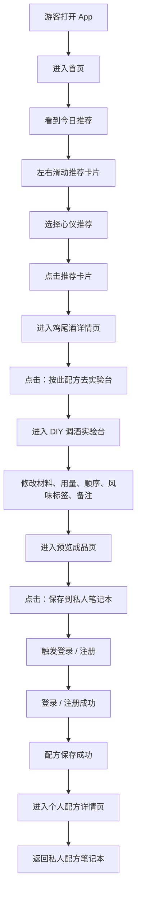

# WishToday 第一版核心流程页面规格

日期：2026-07-08
状态：已确认草案

## 视觉方向

第一版采用已确认的「深棕老钱风 + 香槟金点缀」视觉方向，详见：

```text
docs/visual-direction-v1.zh-CN.md
```

实现核心页面时，不使用 Warm Ivory、cream、beige、sand、off-white 等浅色调作为大面积背景；通过不同深浅棕色、留白、圆角和香槟金点缀营造温暖、复古、高级、微醺的私人调酒实验室氛围。

## 范围

本文档定义 WishToday 第一版 MVP 的核心业务流程与页面规格。第一版只验证一个产品承诺：

```text
游客可以从今日推荐发现一杯鸡尾酒，进入详情了解配方，在实验台改造它，登录后保存为自己的私人配方，并在私人笔记本中看到沉淀结果。
```

第一版不构建完整社区、复杂个人中心、完整设置体系，也不构建通用配方编辑器。

## 核心流程



## 页面分组

发现阶段：
- HomePage 首页

决策阶段：
- CocktailDetailPage 鸡尾酒详情页

改造阶段：
- DiyWorkbenchPage DIY 调酒实验台
- AddIngredientSheet 添加材料弹窗

确认阶段：
- PreviewRecipePage 预览成品页

保存与沉淀阶段：
- AuthPages 登录 / 注册
- RecipeDetailPage 个人配方详情页
- NotebookPage 私人配方笔记本

## 1. HomePage 首页

页面目标：
让游客一打开 App 就理解“今天可以喝什么”，通过今日推荐卡片选择一杯感兴趣的鸡尾酒。

入口：
- 首次打开 App
- 底部 Tab 点击首页
- 从其他页面返回首页

页面内容：
- WishToday 品牌标题
- 一句今日问候或今日灵感文案
- 今日推荐标题
- 每日推荐鸡尾酒横向卡片区域
- 卡片分页指示器

推荐卡片字段：
- 鸡尾酒图片
- 鸡尾酒中文名
- 鸡尾酒英文名
- 风味标签
- 基酒
- 酒精度
- 一句推荐语

主操作：
- 左右滑动推荐卡片
- 点击当前推荐卡片

跳转：
- 点击推荐卡片后进入 CocktailDetailPage
- 跳转时携带 `cocktailId`

状态：
- 推荐加载中
- 推荐加载失败
- 推荐为空
- 图片加载失败
- 游客状态

第一版不做：
- 摇一摇推荐
- 强登录提示
- 复杂个性化推荐
- 天气、城市、心情推荐
- 收藏按钮
- 社区动态入口

已确认决策：
第一条核心流程只使用每日推荐卡片，不包含摇一摇。

## 2. CocktailDetailPage 鸡尾酒详情页

页面目标：
让用户确认这杯推荐鸡尾酒值得尝试，并提供一个明确入口进入实验台改造。

入口：
- 首页点击每日推荐卡片

页面内容：
- 鸡尾酒主图
- 鸡尾酒中文名
- 鸡尾酒英文名
- 一句风味描述或推荐语
- 基酒
- 杯型
- 酒精度
- 制作难度
- 风味标签
- 风味图谱
- 配料清单
- 调制步骤
- 调酒师笔记
- 底部主按钮：按此配方去实验台

内容顺序：
1. 主图、名称、推荐语
2. 基础信息：基酒、杯型、酒精度、制作难度
3. 风味标签
4. 风味图谱
5. 配料清单
6. 调制步骤
7. 调酒师笔记
8. 按此配方去实验台

主操作：
- 向下浏览详情
- 点击「按此配方去实验台」

跳转：
- 点击主按钮后进入 DiyWorkbenchPage
- 跳转时携带 `cocktailId`
- 当前鸡尾酒配方导入为 DIY 初始草稿

导入实验台的数据：
- 配方名称
- 英文名
- 基酒
- 材料列表
- 材料用量
- 材料单位
- 默认步骤顺序
- 风味标签
- 来源鸡尾酒 id

状态：
- 详情加载中
- 详情加载失败
- 详情不存在
- 图片加载失败
- 导入实验台失败
- 游客状态

第一版不做：
- 收藏鸡尾酒
- 评论
- 分享
- 相关推荐
- 相似鸡尾酒
- 长篇故事内容
- 材料替换建议
- 购买材料入口

已确认决策：
详情页第一版只有一个主行动：「按此配方去实验台」。

## 3. DiyWorkbenchPage DIY 调酒实验台

页面目标：
让用户基于导入的经典鸡尾酒进行改造，而不是从空白配方开始编辑。

入口：
- 鸡尾酒详情页点击「按此配方去实验台」

进入页面时：
- 根据 `cocktailId` 读取来源配方
- 创建一份未保存的 DIY 草稿
- 导入来源配方的材料、用量、单位和步骤顺序
- 页面显示「基于 [鸡尾酒名] 改造」

页面内容：
- 页面标题：实验台
- 来源提示：基于 [鸡尾酒名] 改造
- 配方名称输入框
- 英文名输入框，可选
- 已选材料列表
- 添加材料按钮
- 风味标签选择
- 备注输入框
- 底部主按钮：预览成品

已选材料行字段：
- 材料名称
- 材料分类
- 用量
- 单位
- 步骤序号
- 拖拽排序入口
- 删除按钮

材料行支持操作：
- 修改用量
- 修改单位
- 拖拽调整顺序
- 删除材料

主操作：
- 修改配方名称
- 修改材料用量
- 修改材料单位
- 调整材料顺序
- 删除材料
- 添加材料
- 选择风味标签
- 填写备注
- 点击预览成品

跳转：
- 点击添加材料后打开 AddIngredientSheet
- 点击预览成品后进入 PreviewRecipePage
- 进入预览页时携带当前 DIY 草稿

添加材料返回规则：
- 新材料追加到当前草稿
- 原有草稿内容不能丢失

校验规则：
- 配方名称不能为空
- 至少保留 1 个材料
- 每个材料用量不能为空
- 每个材料单位不能为空

状态：
- 草稿初始化中
- 草稿初始化失败
- 正常编辑状态
- 添加材料后状态
- 删除材料后状态
- 拖拽排序后状态
- 草稿未保存状态
- 校验失败状态

第一版不做：
- 从零创建配方
- 编辑已保存配方
- 自动计算酒精度
- 自动生成风味图谱
- 材料替换建议
- 复杂步骤编辑器
- 图片上传
- 草稿箱

已确认决策：
第一版实验台只支持基于经典鸡尾酒导入后改造，不支持从零创建。

## 4. AddIngredientSheet 添加材料弹窗

页面目标：
让用户在改造配方时快速追加一个材料到当前 DIY 草稿中。

入口：
- DIY 调酒实验台点击「添加材料」

页面形态：
- 优先使用底部弹窗或半屏选择器
- 不做完整材料百科页面

页面内容：
- 标题：添加材料
- 搜索框
- 材料分类横向筛选
- 材料列表
- 完成或关闭按钮

材料分类：
- 基酒
- 利口酒
- 糖浆
- 碳酸气泡饮
- 果汁
- 奶制品
- 调味
- 鲜果
- 香草
- 装饰

材料列表项字段：
- 材料名称
- 材料分类
- 简短描述，可选
- 酒精度，可选
- 添加按钮

主操作：
- 搜索材料
- 切换材料分类
- 点击添加材料
- 关闭并返回实验台

添加规则：
- 点击添加后，材料加入当前 DIY 草稿
- 新材料默认用量为空或 0
- 新材料默认单位为 ml
- 新材料步骤序号默认追加到最后
- 添加成功后按钮显示为已添加

重复添加规则：
- 第一版不允许重复添加同一材料
- 如果材料已存在，提示「该材料已在配方中」

返回实验台规则：
- 原有草稿保留
- 已添加材料保留
- 新增材料出现在已选材料列表最后

状态：
- 材料列表加载中
- 材料列表加载失败
- 搜索中
- 搜索无结果
- 当前分类为空
- 添加成功
- 重复添加提示
- 网络异常

第一版不做：
- 材料详情页
- 材料图片上传
- 自定义新材料
- 批量添加多个材料
- 替代材料推荐
- 材料收藏
- 材料百科说明

已确认决策：
添加材料第一版做成底部弹窗或半屏选择器，不做独立完整材料库页面。

## 5. PreviewRecipePage 预览成品页

页面目标：
让用户在保存前确认改造后的配方是否完整，并强化“这是我的一杯酒”的确定感。

入口：
- DIY 调酒实验台点击「预览成品」

页面内容：
- 页面标题：预览成品
- 配方名称
- 英文名，可选
- 来源提示：改造自 [经典鸡尾酒名]
- 基酒
- 风味标签
- 配料总览
- 调制顺序
- 我的备注
- 次要按钮：返回编辑
- 主按钮：保存到私人笔记本

配料总览字段：
- 材料名称
- 用量
- 单位

调制顺序字段：
- 步骤序号
- 材料名称
- 用量
- 单位

主操作：
- 查看预览内容
- 点击返回编辑
- 点击保存到私人笔记本

跳转：
- 返回编辑：回到 DiyWorkbenchPage，并保留全部草稿内容
- 保存成功：进入 RecipeDetailPage，展示刚保存的私人配方

保存规则：
- 如果用户未登录，进入 Auth Flow
- 如果用户已登录，直接保存

校验规则：
- 配方名称不能为空
- 至少 1 个材料
- 每个材料用量不能为空
- 每个材料单位不能为空

状态：
- 预览正常
- 草稿为空
- 配方名称缺失
- 材料缺失
- 材料用量缺失
- 保存中
- 保存失败
- 保存成功
- 未登录拦截

第一版不做：
- 保存并发布到社区
- 上传成品图
- 生成分享海报
- 自动计算酒精度
- 自动生成口味评分
- 保存草稿

已确认决策：
预览页第一版只保留「保存到私人笔记本」，不做发布。

## 6. Auth Flow 登录 / 注册流程

页面目标：
只在用户需要保存私人配方时进行认证，并在认证成功后自动继续保存动作。

触发入口：
- 预览成品页点击「保存到私人笔记本」
- 系统检测到用户未登录

第一版认证策略：
- 首次打开 App 不强制登录
- 浏览首页不强制登录
- 查看鸡尾酒详情不强制登录
- 进入实验台不强制登录
- 预览成品不强制登录
- 只有保存私人配方时才强制登录或注册

登录页内容：
- WishToday 品牌名称
- 提示文案：登录后保存你的私人配方
- 账号输入框
- 密码输入框
- 登录按钮
- 注册入口

注册页内容：
- WishToday 品牌名称
- 昵称输入框
- 账号输入框
- 密码输入框
- 确认密码输入框
- 注册按钮
- 返回登录入口

认证成功后：
- 回到保存流程
- 自动提交当前 DIY 草稿
- 保存成功后进入 RecipeDetailPage

必须保留的草稿数据：
- 来源鸡尾酒 id
- 配方名称
- 英文名
- 材料列表
- 材料用量
- 材料单位
- 步骤顺序
- 风味标签
- 备注

失败处理：
- 登录失败：停留登录页并展示失败原因
- 注册失败：停留注册页并展示失败原因
- 认证成功但保存失败：返回 PreviewRecipePage，并允许重试
- 登录 / 注册过程中草稿不能丢失

状态：
- 未登录拦截
- 登录中
- 登录失败
- 注册中
- 注册失败
- 认证成功
- 认证成功后保存中
- 认证成功后保存失败
- 认证成功后保存成功

第一版不做：
- 第三方登录
- 完整忘记密码流程
- 手机验证码登录
- 强用户协议流程
- 头像上传
- 登录后跳首页

已确认决策：
登录 / 注册是保存动作的一部分。认证成功后必须继续保存，并进入个人配方详情页。

## 7. RecipeDetailPage 个人配方详情页

页面目标：
展示刚保存的私人配方，让用户确认自己的改造成果已经沉淀到 WishToday。

入口：
- 预览成品页保存成功后自动进入
- 私人配方笔记本点击配方卡片进入

页面内容：
- 配方名称
- 英文名，可选
- 来源提示：改造自 [经典鸡尾酒名]
- 创建时间
- 风味标签
- 配料清单
- 调制顺序
- 我的备注
- 按钮：返回私人笔记本

配料清单字段：
- 材料名称
- 用量
- 单位

调制顺序字段：
- 步骤序号
- 材料名称
- 用量
- 单位

主操作：
- 查看私人配方详情
- 返回私人笔记本

跳转：
- 点击返回私人笔记本后进入 NotebookPage
- 从笔记本进入时，根据 `recipeId` 加载私人配方

保存成功进入时：
- 展示保存成功提示
- 展示刚保存的配方内容

状态：
- 详情加载中
- 详情加载失败
- 详情不存在
- 保存成功提示

第一版不做：
- 编辑配方
- 删除配方
- 发布到社区
- 收藏配方
- 上传成品图
- 生成分享海报
- 公开访问
- 评论或点赞

已确认决策：
个人配方详情页第一版只读，不做编辑、删除、分享。

## 8. NotebookPage 私人配方笔记本

页面目标：
让用户查看自己保存过的私人配方，确认 WishToday 可以沉淀个人调酒记录。

入口：
- 个人配方详情页点击「返回私人笔记本」
- 后续可从简化版我的页面进入

页面内容：
- 页面标题：私人笔记本
- 配方列表
- 空状态引导

配方卡片字段：
- 配方名称
- 英文名，可选
- 来源鸡尾酒
- 创建时间
- 风味标签
- 材料数量
- 简短备注，可选

主操作：
- 查看配方列表
- 点击配方卡片

跳转：
- 点击配方卡片后进入 RecipeDetailPage
- 跳转时携带 `recipeId`

空状态：
- 文案：你还没有保存任何配方
- 操作：去首页找一杯今天想喝的酒

状态：
- 列表加载中
- 列表加载失败
- 列表为空
- 未登录状态

未登录处理：
- 未登录用户访问私人笔记本时，进入登录 / 注册
- 认证成功后进入 NotebookPage

第一版不做：
- 搜索
- 日期筛选
- 风味筛选
- 基酒筛选
- 收藏
- 删除
- 批量管理
- 列表排序切换
- 分享入口

已确认决策：
私人配方笔记本第一版只做按创建时间倒序的列表。

## 全局第一版不做范围

- 摇一摇推荐
- 社区信息流
- 发布到社区
- 用户主页
- 关注
- 评论
- 点赞
- 收藏
- 保存后编辑配方
- 删除已保存配方
- 设置页
- 账号与安全页
- 隐私设置页
- 通知设置页
- 浏览历史
- 上传成品图
- 生成分享海报
- 从零创建配方

## 验收标准

- 游客可以打开 App 并直接进入首页，不需要登录。
- 首页展示每日推荐卡片，并支持左右滑动。
- 点击推荐卡片可以进入鸡尾酒详情页。
- 鸡尾酒详情页只有一个主行动：「按此配方去实验台」。
- 点击主行动后进入 DIY 调酒实验台，并导入来源配方。
- DIY 调酒实验台支持修改配方名称、用量、单位、顺序、风味标签和备注。
- 添加材料弹窗可以追加非重复材料，且不会丢失当前草稿。
- 预览成品页可以准确展示当前 DIY 草稿。
- 预览页保存时，仅在用户未登录时触发登录 / 注册。
- 登录或注册成功后，系统自动继续保存当前配方。
- 保存成功后进入刚保存的个人配方详情页。
- 个人配方详情页第一版为只读。
- 私人配方笔记本按创建时间倒序展示已保存配方。
- 相关页面都需要处理加载中、空状态、失败状态和未登录状态。

## 后续实现提示

- DIY 草稿应作为流程级状态保存，必须能跨实验台、添加材料、预览、登录 / 注册和保存重试流程存活。
- 认证重定向状态必须明确表达为 `saveRecipe`，不能在登录成功后跳转首页。
- 页面层级和按钮设计必须围绕核心 MVP 流程，不能把 P1 功能加回页面头部、底部或更多菜单中。
