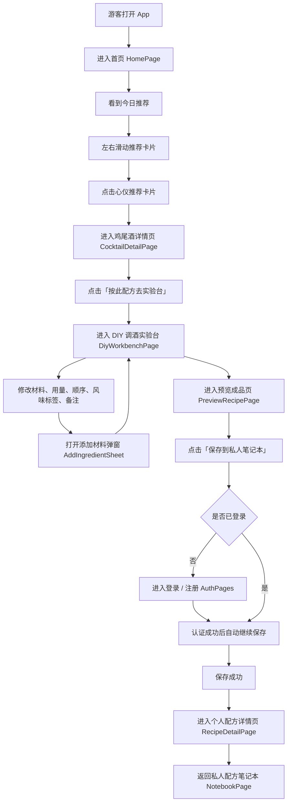

# WishToday 第一版核心流程页面级详细需求文档

日期：2026-07-08
文档状态：核心流程已确认，供 Codex / Cursor / Claude Code 页面开发使用

## 视觉方向

第一版采用已确认的「深棕老钱风 + 香槟金点缀」视觉方向，详见：

```text
docs/visual-direction-v1.zh-CN.md
```

页面实现必须保持移动端优先、温暖、复古、高级、留白充足。不得使用 Warm Ivory、cream、beige、sand、off-white 等浅色调作为大面积背景；不得把社区、摇一摇、发布、收藏、搜索筛选等后置功能通过视觉入口带回第一版。

## 0. 文档范围

本文档只覆盖 WishToday 第一版第一条核心流程：

```text
首页推荐
-> 鸡尾酒详情
-> 实验台改造
-> 添加材料
-> 预览成品
-> 登录 / 注册后保存
-> 个人配方详情
-> 私人配方笔记本
```

第一版目标不是做完整 App，而是验证用户是否愿意从一杯推荐鸡尾酒出发，改造成自己的私人配方，并保存为个人调酒记录。

## 0.1 第一版核心原则

```text
游客先看到价值，再在保存时登录。
详情页只保留一个主行动：按此配方去实验台。
实验台只支持基于经典鸡尾酒改造，不支持从零创建。
预览页只保存到私人笔记本，不发布到社区。
保存成功后必须进入刚保存的个人配方详情页。
私人笔记本第一版只做倒序列表，不做搜索、筛选、收藏、删除。
```

## 0.2 核心流程图



## 0.3 页面清单

本流程包含 8 个页面 / 页面形态：

```text
1. HomePage 首页
2. CocktailDetailPage 鸡尾酒详情页
3. DiyWorkbenchPage DIY 调酒实验台
4. AddIngredientSheet 添加材料弹窗
5. PreviewRecipePage 预览成品页
6. AuthPages 登录 / 注册页
7. RecipeDetailPage 个人配方详情页
8. NotebookPage 私人配方笔记本
```

---

# 1. HomePage 首页

## 1.1 页面目标

让游客一进入 App 就看到“今天可以喝什么”，通过横向滑动的今日推荐卡片选择一杯心仪鸡尾酒，并进入详情页。

## 1.2 页面入口

```text
首次打开 App
底部 Tab 点击首页
从鸡尾酒详情页返回
从私人笔记本空状态返回首页
```

## 1.3 页面路由建议

```text
/home
```

## 1.4 页面展示内容

页面从上到下展示：

```text
WishToday 品牌标题
今日问候 / 今日灵感文案
今日推荐标题
每日推荐鸡尾酒横向卡片 Carousel
卡片分页指示器
```

## 1.5 今日推荐卡片字段

每张推荐卡片展示：

```text
鸡尾酒图片
鸡尾酒中文名
鸡尾酒英文名
风味标签
基酒
酒精度
一句推荐语
```

## 1.6 核心功能

```text
加载今日推荐鸡尾酒列表
展示 7 张推荐卡片
支持左右滑动切换卡片
点击当前卡片进入鸡尾酒详情页
```

## 1.7 交互规则

```text
游客打开 App 直接进入首页，不要求登录
推荐卡片支持左右滑动
分页指示器跟随当前卡片变化
点击推荐卡片跳转到 /cocktails/:cocktailId
推荐加载失败时提供重试入口
推荐为空时显示友好空状态
```

## 1.8 状态要求

```text
初始状态
推荐加载中
推荐加载成功
推荐加载失败
推荐为空
图片加载失败
游客状态
```

## 1.9 第一版不做

```text
摇一摇推荐
强登录提示
复杂个性化推荐
天气推荐
城市推荐
心情推荐
收藏按钮
社区入口
底部信息流
```

## 1.10 验收标准

```text
游客无需登录即可看到首页
首页展示今日推荐卡片
推荐卡片可以左右滑动
点击推荐卡片可以进入对应鸡尾酒详情页
推荐加载失败、为空、图片失败都有明确状态
页面视觉符合高级、温暖、复古、留白充足的方向
```

---

# 2. CocktailDetailPage 鸡尾酒详情页

## 2.1 页面目标

让用户确认这杯鸡尾酒值得尝试，并通过唯一主行动进入实验台改造。

## 2.2 页面入口

```text
首页点击今日推荐卡片
```

## 2.3 页面路由建议

```text
/cocktails/:cocktailId
```

## 2.4 页面展示内容

页面从上到下展示：

```text
鸡尾酒主图
鸡尾酒中文名
鸡尾酒英文名
一句风味描述 / 推荐语
基础信息区
风味标签区
风味图谱区
配料清单区
调制步骤区
调酒师笔记区
底部主按钮：按此配方去实验台
```

基础信息区展示：

```text
基酒
杯型
酒精度
制作难度
```

风味图谱区展示：

```text
甜度
苦度
酸度
香气
酒感
酒精
```

配料清单区展示：

```text
材料名称
用量
单位
```

调制步骤区展示：

```text
步骤序号
步骤说明
```

调酒师笔记区展示：

```text
技巧
注意事项
口味建议
```

## 2.5 核心功能

```text
加载鸡尾酒详情
展示完整配方信息
点击「按此配方去实验台」
将当前鸡尾酒导入为 DIY 初始草稿
```

## 2.6 导入实验台的数据

点击主按钮后，需要向实验台传递或生成：

```text
sourceCocktailId
配方名称
英文名
基酒
材料列表
材料用量
材料单位
默认步骤顺序
风味标签
```

## 2.7 交互规则

```text
页面加载完成后展示详情内容
用户可以上下滚动查看详情
底部主按钮始终表达唯一主行动
点击主按钮进入 /diy?sourceCocktailId=:cocktailId
导入失败时停留当前页并提示失败原因
```

## 2.8 状态要求

```text
详情加载中
详情加载成功
详情加载失败
详情不存在
图片加载失败
导入实验台中
导入实验台失败
游客状态
```

## 2.9 第一版不做

```text
收藏鸡尾酒
评论
分享
相关推荐
相似鸡尾酒
长篇故事内容
材料替换建议
购买材料入口
```

## 2.10 验收标准

```text
详情字段展示完整
风味图谱正常展示
配料清单和调制步骤清晰可读
页面只有一个主行动：按此配方去实验台
点击主行动可以进入实验台并带入当前配方
详情加载失败和不存在状态有明确提示
```

---

# 3. DiyWorkbenchPage DIY 调酒实验台

## 3.1 页面目标

让用户基于经典鸡尾酒导入的草稿进行改造，完成材料、用量、顺序、风味标签和备注的编辑。

## 3.2 页面入口

```text
鸡尾酒详情页点击「按此配方去实验台」
```

## 3.3 页面路由建议

```text
/diy?sourceCocktailId=:cocktailId
```

## 3.4 进入页面规则

```text
根据 sourceCocktailId 读取来源配方
创建一份未保存的 DIY 草稿
导入来源配方材料、用量、单位、步骤顺序、风味标签
页面显示「基于 [鸡尾酒名] 改造」
```

## 3.5 页面展示内容

页面从上到下展示：

```text
页面标题：实验台
来源提示：基于 [鸡尾酒名] 改造
配方名称输入框
英文名输入框，可选
已选材料列表
添加材料按钮
风味标签选择区
备注输入框
底部主按钮：预览成品
```

## 3.6 已选材料行字段

每个材料行展示：

```text
材料名称
材料分类
用量输入
单位选择
步骤序号
拖拽排序入口
删除按钮
```

## 3.7 核心功能

```text
修改配方名称
修改英文名
修改材料用量
修改材料单位
拖拽调整材料顺序
删除材料
添加材料
选择风味标签
填写备注
点击预览成品
```

## 3.8 交互规则

```text
进入页面时默认带入来源配方
修改任意字段后草稿进入未保存状态
拖拽材料后，步骤序号自动更新
删除材料后，剩余材料步骤序号自动重排
点击添加材料打开 AddIngredientSheet
从添加材料弹窗返回后，原草稿不能丢失
点击预览成品前执行校验
校验通过后进入 PreviewRecipePage
```

## 3.9 校验规则

```text
配方名称不能为空
至少保留 1 个材料
每个材料用量不能为空
每个材料单位不能为空
```

## 3.10 跳转规则

```text
添加材料：打开 AddIngredientSheet
预览成品：进入 /diy/preview
返回详情页：返回 CocktailDetailPage 时不要求保存草稿
```

## 3.11 状态要求

```text
草稿初始化中
草稿初始化成功
草稿初始化失败
正常编辑状态
草稿未保存状态
添加材料后状态
删除材料后状态
拖拽排序后状态
校验失败状态
```

## 3.12 第一版不做

```text
从零创建配方
编辑已保存配方
自动计算酒精度
自动生成风味图谱
材料替换建议
复杂步骤编辑器
图片上传
草稿箱
```

## 3.13 验收标准

```text
实验台可以从经典鸡尾酒导入初始草稿
用户可以修改名称、用量、单位、顺序、风味标签和备注
拖拽排序后步骤序号正确更新
删除材料后列表仍然合法
添加材料返回后草稿不丢失
校验失败时有明确提示
校验通过后可以进入预览成品页
```

---

# 4. AddIngredientSheet 添加材料弹窗

## 4.1 页面目标

让用户在实验台改造过程中快速追加一个材料，不离开当前改造心流。

## 4.2 页面入口

```text
DIY 调酒实验台点击「添加材料」
```

## 4.3 页面形态

```text
底部弹窗或半屏选择器
不做独立完整材料库页面
```

## 4.4 页面展示内容

```text
标题：添加材料
搜索框
材料分类横向筛选
材料列表
关闭按钮
```

## 4.5 材料分类

```text
基酒
利口酒
糖浆
碳酸气泡饮
果汁
奶制品
调味
鲜果
香草
装饰
```

## 4.6 材料列表项字段

```text
材料名称
材料分类
简短描述，可选
酒精度，可选
添加按钮
```

## 4.7 核心功能

```text
搜索材料
按材料分类筛选
点击添加材料
关闭弹窗返回实验台
```

## 4.8 添加规则

```text
点击添加后，材料加入当前 DIY 草稿
新材料默认用量为空或 0
新材料默认单位为 ml
新材料步骤序号追加到最后
添加成功后按钮显示为已添加
```

## 4.9 重复添加规则

```text
第一版不允许重复添加同一材料
如果材料已存在，提示「该材料已在配方中」
不修改原有材料的用量、单位、顺序
```

## 4.10 返回实验台规则

```text
关闭弹窗后返回 DiyWorkbenchPage
原有草稿保留
已添加材料保留
新增材料出现在已选材料列表最后
```

## 4.11 状态要求

```text
材料列表加载中
材料列表加载失败
搜索中
搜索无结果
当前分类为空
添加成功
重复添加提示
网络异常
```

## 4.12 第一版不做

```text
材料详情页
材料图片上传
自定义新材料
批量添加多个材料
替代材料推荐
材料收藏
材料百科说明
```

## 4.13 验收标准

```text
点击添加材料可以打开底部弹窗
分类切换和搜索可用
点击添加后材料能进入当前 DIY 草稿
重复材料不能被再次添加
关闭弹窗后实验台草稿不丢失
加载失败、搜索无结果、分类为空都有明确提示
```

---

# 5. PreviewRecipePage 预览成品页

## 5.1 页面目标

让用户在保存前确认改造后的配方内容，并准备将其保存为私人配方。

## 5.2 页面入口

```text
DIY 调酒实验台点击「预览成品」
```

## 5.3 页面路由建议

```text
/diy/preview
```

## 5.4 页面展示内容

页面从上到下展示：

```text
页面标题：预览成品
配方名称
英文名，可选
来源提示：改造自 [经典鸡尾酒名]
基酒
风味标签
配料总览
调制顺序
我的备注
返回编辑按钮
保存到私人笔记本按钮
```

配料总览展示：

```text
材料名称
用量
单位
```

调制顺序展示：

```text
步骤序号
材料名称
用量
单位
```

## 5.5 核心功能

```text
读取当前 DIY 草稿
展示预览内容
返回实验台继续编辑
保存到私人笔记本
```

## 5.6 交互规则

```text
返回编辑后，当前草稿不丢失
点击保存到私人笔记本前执行保存校验
用户未登录时进入 Auth Flow
用户已登录时直接保存
保存失败时停留当前页并允许重试
保存成功后进入 RecipeDetailPage
```

## 5.7 校验规则

```text
配方名称不能为空
至少 1 个材料
每个材料用量不能为空
每个材料单位不能为空
```

## 5.8 状态要求

```text
预览正常
草稿为空
配方名称缺失
材料缺失
材料用量缺失
保存中
保存失败
保存成功
未登录拦截
```

## 5.9 第一版不做

```text
保存并发布到社区
上传成品图
生成分享海报
自动计算酒精度
自动生成口味评分
保存草稿
```

## 5.10 验收标准

```text
预览页展示内容与实验台草稿一致
返回编辑后草稿不丢失
保存前校验有效
未登录用户保存时进入登录 / 注册
已登录用户保存时直接保存
保存失败可重试
保存成功后进入刚保存的个人配方详情页
```

---

# 6. AuthPages 登录 / 注册页

## 6.1 页面目标

只在保存私人配方时要求用户登录或注册，并在认证成功后自动继续保存当前配方。

## 6.2 触发入口

```text
预览成品页点击「保存到私人笔记本」
系统检测到用户未登录
```

## 6.3 页面路由建议

```text
/login?redirectAction=saveRecipe
/register?redirectAction=saveRecipe
```

## 6.4 第一版认证策略

```text
首次打开 App 不强制登录
浏览首页不强制登录
查看鸡尾酒详情不强制登录
进入实验台不强制登录
预览成品不强制登录
只有保存私人配方时强制登录 / 注册
```

## 6.5 登录页展示内容

```text
WishToday 品牌名称
提示文案：登录后保存你的私人配方
账号输入框
密码输入框
登录按钮
注册入口
```

## 6.6 注册页展示内容

```text
WishToday 品牌名称
昵称输入框
账号输入框
密码输入框
确认密码输入框
注册按钮
返回登录入口
```

## 6.7 必须保留的草稿数据

认证过程中必须保留：

```text
来源鸡尾酒 id
配方名称
英文名
材料列表
材料用量
材料单位
步骤顺序
风味标签
备注
```

## 6.8 登录交互规则

```text
账号不能为空
密码不能为空
登录中不可重复点击登录按钮
登录失败停留当前页并展示失败原因
登录成功后不跳首页
登录成功后继续执行 saveRecipe
```

## 6.9 注册交互规则

```text
昵称不能为空
账号不能为空
密码不能为空
确认密码必须与密码一致
注册中不可重复点击注册按钮
注册失败停留当前页并展示失败原因
注册成功后继续执行 saveRecipe
```

## 6.10 认证成功后的保存规则

```text
认证成功后自动提交当前 DIY 草稿
保存中展示 loading
保存失败返回 PreviewRecipePage 并允许重试
保存成功进入 RecipeDetailPage
```

## 6.11 状态要求

```text
未登录拦截
登录中
登录失败
注册中
注册失败
认证成功
认证成功后保存中
认证成功后保存失败
认证成功后保存成功
```

## 6.12 第一版不做

```text
第三方登录
完整忘记密码流程
手机号验证码登录
强用户协议流程
头像上传
登录后跳首页
```

## 6.13 验收标准

```text
用户只在保存私人配方时被要求登录 / 注册
登录页明确提示登录是为了保存私人配方
注册页可以完成最小注册流程
登录 / 注册失败有明确提示
认证过程中 DIY 草稿不丢失
认证成功后自动继续保存
保存成功后进入个人配方详情页
```

---

# 7. RecipeDetailPage 个人配方详情页

## 7.1 页面目标

展示用户刚保存的私人配方，让用户确认自己的改造成果已经沉淀到 WishToday。

## 7.2 页面入口

```text
预览成品页保存成功后自动进入
私人配方笔记本点击配方卡片进入
```

## 7.3 页面路由建议

```text
/recipes/:recipeId
```

## 7.4 页面展示内容

页面从上到下展示：

```text
保存成功提示，可选
配方名称
英文名，可选
来源提示：改造自 [经典鸡尾酒名]
创建时间
风味标签
配料清单
调制顺序
我的备注
返回私人笔记本按钮
```

配料清单字段：

```text
材料名称
用量
单位
```

调制顺序字段：

```text
步骤序号
材料名称
用量
单位
```

## 7.5 核心功能

```text
加载私人配方详情
展示刚保存的配方
从笔记本进入时按 recipeId 展示历史配方
返回私人笔记本
```

## 7.6 交互规则

```text
保存成功进入时展示保存成功反馈
从笔记本进入时不展示保存成功反馈
点击返回私人笔记本进入 NotebookPage
详情不存在时展示友好错误状态
```

## 7.7 状态要求

```text
详情加载中
详情加载成功
详情加载失败
详情不存在
保存成功提示
```

## 7.8 第一版不做

```text
编辑配方
删除配方
发布到社区
收藏配方
上传成品图
生成分享海报
公开访问
评论
点赞
```

## 7.9 验收标准

```text
保存成功后进入刚保存的个人配方详情页
页面展示配方名称、来源、风味标签、配料、调制顺序和备注
从笔记本点击配方也能进入详情
详情页第一版为只读
点击返回私人笔记本可以进入列表页
详情加载失败和不存在状态有明确提示
```

---

# 8. NotebookPage 私人配方笔记本

## 8.1 页面目标

让用户查看自己保存过的私人配方，确认 WishToday 可以沉淀个人调酒记录。

## 8.2 页面入口

```text
个人配方详情页点击「返回私人笔记本」
未登录用户认证成功后进入私人笔记本
后续可从简化版我的页面进入
```

## 8.3 页面路由建议

```text
/notebook
```

## 8.4 页面展示内容

```text
页面标题：私人笔记本
配方列表
空状态引导
```

## 8.5 配方卡片字段

```text
配方名称
英文名，可选
来源鸡尾酒
创建时间
风味标签
材料数量
简短备注，可选
```

## 8.6 核心功能

```text
查看私人配方列表
按创建时间倒序展示
点击配方卡片进入个人配方详情页
```

## 8.7 交互规则

```text
列表默认按创建时间倒序
点击配方卡片进入 /recipes/:recipeId
列表为空时展示空状态
未登录访问时进入登录 / 注册
认证成功后返回 NotebookPage
```

## 8.8 空状态

空状态展示：

```text
你还没有保存任何配方
去首页找一杯今天想喝的酒
```

空状态操作：

```text
点击操作后进入 HomePage
```

## 8.9 状态要求

```text
列表加载中
列表加载成功
列表加载失败
列表为空
未登录状态
```

## 8.10 第一版不做

```text
搜索
日期筛选
风味筛选
基酒筛选
收藏
删除
批量管理
列表排序切换
分享入口
```

## 8.11 验收标准

```text
私人笔记本可以展示用户已保存配方
列表按创建时间倒序
配方卡片字段清晰
点击配方卡片进入对应个人配方详情页
空状态有明确文案和返回首页入口
未登录访问时进入登录 / 注册
登录后返回私人笔记本
```

---

# 9. 全局状态与异常要求

所有核心流程页面必须处理：

```text
加载中
加载失败
空状态
提交中
提交失败
网络异常
未登录状态
图片加载失败
```

空状态不能只显示空白，必须包含：

```text
清晰提示文案
可选操作入口
符合 WishToday 风格的视觉表现
```

错误状态必须包含：

```text
错误提示
重试入口
不崩溃
不红屏
```

---

# 10. 第一版全局不做范围

```text
摇一摇推荐
酒单首页
社区信息流
发布到社区
用户主页
关注
评论
点赞
收藏
保存后编辑配方
删除已保存配方
设置页
账号与安全页
隐私设置页
通知设置页
编辑个人资料
浏览历史
上传成品图
生成分享海报
从零创建配方
```

---

# 11. 总体验收标准

```text
游客可以打开 App 并直接进入首页
首页展示今日推荐卡片并支持左右滑动
点击推荐卡片进入鸡尾酒详情页
详情页展示配方信息并只保留「按此配方去实验台」主行动
实验台可以导入来源配方并允许用户改造
添加材料弹窗可以追加非重复材料
预览页准确展示当前 DIY 草稿
未登录用户点击保存时进入登录 / 注册
登录 / 注册成功后自动继续保存
保存成功后进入刚保存的个人配方详情页
用户可以从个人配方详情页返回私人笔记本
私人笔记本展示已保存配方倒序列表
被明确后置的功能没有出现在主流程页面中
所有页面都有 loading / error / empty / unauthenticated 等必要状态
```

---

# 12. 给开发代理的执行约束

```text
不要把本文件列为不做的功能加回第一版。
不要把登录作为首次打开 App 的入口。
不要让登录成功后跳首页。
不要在详情页增加收藏、分享、评论等次要行动。
不要把实验台扩展成从零创建配方的通用编辑器。
不要在预览页增加保存并发布。
不要在个人配方详情页增加编辑、删除、分享。
不要在私人笔记本增加搜索、筛选、收藏、删除。
```

第一版只围绕这一条链路完成：

```text
今日推荐 -> 详情 -> 实验台 -> 预览 -> 登录保存 -> 配方详情 -> 私人笔记本
```
