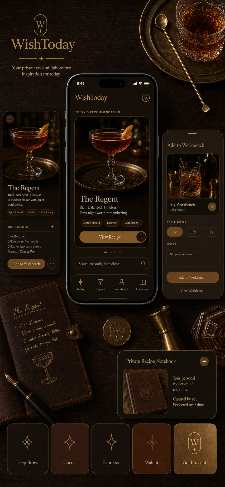

# WishToday V1 视觉方向确认

日期：2026-07-09
状态：已确认

## 1. 结论

WishToday 第一版采用「深棕老钱风 + 香槟金点缀」作为主视觉方向。

本方向用于第一版核心链路：

```text
今日推荐 -> 详情 -> 实验台 -> 预览 -> 登录保存 -> 配方详情 -> 私人笔记本
```

第一版视觉目标不是做热闹社区，也不是做工具型表单后台，而是让用户打开 App 时感到：

```text
高级
温暖
微醺
复古
像一个私人调酒实验室
```

## 2. 参考图

最终采用的主色方向图：



该图作为视觉气质、色彩关系、圆角语言、暗色面积控制和香槟金点缀比例的参考，不要求前端逐像素复刻。

## 3. 主色方向

### 3.1 色彩原则

第一版使用深棕色作为主色调，不再使用 Warm Ivory 作为主色或背景色。

色彩关系：

```text
深棕色：主背景、品牌氛围、页面基底
不同深浅棕色：卡片、表单、底部弹窗、层级分隔
香槟金 / 暖金色：主按钮、选中态、关键强调、细线装饰
浅香槟文字色：深色背景上的主要文字
```

### 3.2 禁止色调

第一版视觉系统不使用以下色调作为主视觉或大面积背景：

```text
Warm Ivory
ivory
cream
beige
sand
off-white
浅米白
奶油白
暖象牙白
浅纸张色
```

如果需要留白，使用不同深浅棕色、透明度、间距和阴影制造呼吸感，而不是引入浅米白底色。

### 3.3 建议色板

前端可以以以下 token 为起点，后续根据真实页面截图微调：

```text
--wt-brown-950: #18100c;  页面最深背景
--wt-brown-900: #241711;  主背景
--wt-brown-850: #2d1d15;  页面分区背景
--wt-brown-800: #38251a;  卡片背景
--wt-brown-700: #4a3021;  输入框 / 次级卡片
--wt-brown-600: #60412c;  边框、分隔、弱强调
--wt-brown-500: #7a5539;  次级按钮、辅助信息
--wt-gold-500:  #c9a15a;  香槟金主强调
--wt-gold-600:  #a8782c;  金色按下态 / 深金
--wt-gold-300:  #efd08a;  深色背景上的高亮信息
--wt-text-main: #f3dfb4;  主要文字，偏浅香槟
--wt-text-sub:  #c7ab7a;  次级文字
--wt-line:      rgba(201, 161, 90, 0.22);
--wt-shadow:    rgba(0, 0, 0, 0.34);
```

注意：`--wt-text-main` 是深色界面上的浅香槟文字，不作为大面积背景色使用。

## 4. UI 形态要求

### 4.1 圆角

第一版界面避免方正、死板的按钮和卡片。

建议：

```text
主按钮：胶囊形或 999px 圆角
次级按钮：胶囊形或 16px 以上圆角
推荐卡片：24px-32px 大圆角
内容卡片：20px-28px 圆角
输入框：16px-20px 圆角
底部弹窗：顶部 28px-36px 大圆角
小标签：999px 胶囊形
```

### 4.2 暗色面积控制

虽然深棕是主色，但页面不能压抑或拥挤。

落地规则：

```text
页面基底使用最深棕。
主要内容卡片使用比背景浅一档的棕色。
输入区域使用再浅一档的棕色，保证可读性。
香槟金只用于主 CTA、选中态和少量精致线条。
不要让大面积金色、纯黑或高饱和红色成为主视觉。
```

### 4.3 留白

留白通过空间关系实现，不依赖浅色背景。

建议：

```text
移动端页面左右安全边距：20px 起
卡片内部边距：20px-24px
页面区块间距：24px-32px
表单控件间距：14px-18px
底部固定按钮与内容之间保留足够滚动缓冲
```

## 5. 页面应用

### 5.1 HomePage 首页

首页应最强地表达品牌氛围：

```text
深棕背景
大圆角今日推荐卡片
真实或 AI 生成的鸡尾酒摄影图
香槟金主 CTA / 当前分页点
少量复古纸签或酒标感信息层
```

首页第一版不展示摇一摇、社区入口、收藏按钮或复杂 Tab。

### 5.2 CocktailDetailPage 鸡尾酒详情页

详情页以鸡尾酒图片和配方内容为主，不做故事化长页面。

要求：

```text
主图保持真实摄影感和暖色酒吧光线。
基础信息、风味标签、风味图谱、配料、步骤分别成块。
每个内容块使用棕色层级卡片承载。
底部主按钮使用香槟金，文案为「按此配方去实验台」。
```

### 5.3 DiyWorkbenchPage 实验台

实验台要像私人调酒工作台，而不是后台表格。

要求：

```text
输入框和材料行使用圆角棕色容器。
材料行保持清晰，不堆叠过多装饰。
拖拽、删除、单位选择等工具按钮使用克制图标。
「预览成品」作为唯一底部主行动。
```

### 5.4 AddIngredientSheet 添加材料弹窗

添加材料采用半屏底部 Sheet。

要求：

```text
顶部大圆角。
背景比页面主背景浅一档。
分类使用胶囊按钮。
已添加状态使用香槟金弱强调。
不做独立材料百科页面。
```

### 5.5 PreviewRecipePage 预览成品页

预览页要强化「这是我的一杯酒」的确定感。

要求：

```text
配方名称优先级最高。
来源提示弱化展示。
配料和调制顺序分块展示。
主按钮为「保存到私人笔记本」。
不出现发布、分享、上传成品图入口。
```

### 5.6 AuthPages 登录 / 注册

认证页只服务保存动作，不作为 App 首屏。

要求：

```text
文案明确说明：登录后保存你的私人配方。
表单保持温暖、克制、低干扰。
登录 / 注册成功后继续 saveRecipe，不跳首页。
```

### 5.7 RecipeDetailPage 个人配方详情页

个人配方详情页第一版只读。

要求：

```text
保存成功提示可使用香槟金弱强调。
配方内容按卡片区块展示。
只保留返回私人笔记本按钮。
不出现编辑、删除、分享、发布入口。
```

### 5.8 NotebookPage 私人笔记本

笔记本像私人记录，不像管理后台。

要求：

```text
列表按创建时间倒序。
卡片展示配方名称、来源、创建时间、风味标签、材料数量和简短备注。
空状态引导「去首页找一杯今天想喝的酒」。
不做搜索、筛选、收藏、删除。
```

## 6. AI 图片方向

第一版鸡尾酒图片使用 AI 生成图。

图片要求：

```text
真实摄影感
复古暖色酒吧光线
深棕 / 琥珀 / 酒红 / 香槟金色彩关系
清晰展示鸡尾酒杯和酒液
适合移动端卡片裁切
同一批图片风格统一
不要卡通化
不要霓虹夜店风
不要过度暗黑
不要出现品牌水印或复杂文字
```

## 7. 验收标准

视觉方向验收时检查：

```text
页面主视觉是否以深棕体系为主。
是否没有 Warm Ivory、cream、beige、sand、off-white 等大面积浅底。
香槟金是否只作为点缀和主 CTA 使用。
页面是否温暖、复古、高级、微醺。
移动端阅读是否清晰，不因深色背景造成疲劳。
按钮、卡片、输入框、底部弹窗是否使用圆角或胶囊形。
页面是否有序、整洁、留白充足。
是否没有把社区、摇一摇、发布、收藏、搜索筛选等后置功能放回第一版。
```

## 8. 与技术实现的关系

前端实现仍使用原生 CSS 与 CSS variables。正式实现核心页面时，应先将本文件中的色彩 token 映射到全局样式变量，再实现页面组件。

当前文档只确认产品与视觉方向，不要求立即修改代码。
